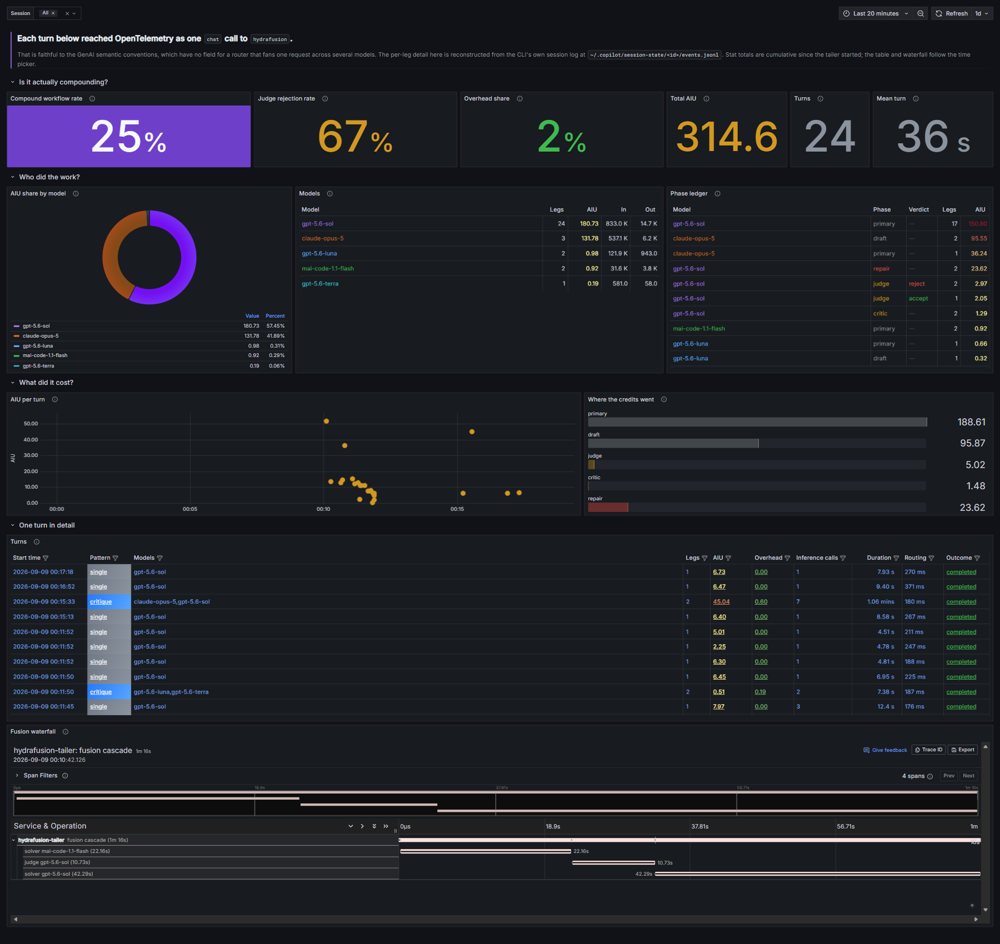
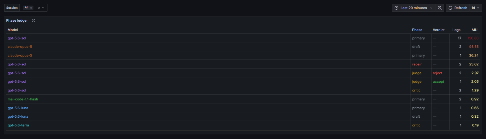
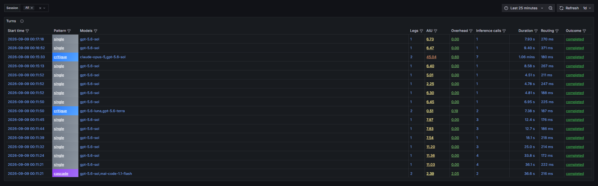

# hydrafusion-traces

See which models GitHub Copilot CLI's HydraFusion ran for each turn, in a Grafana
dashboard.



> An independent side project. Not affiliated with, endorsed by, or supported by GitHub.
> HydraFusion is a research preview; everything here was observed from the outside and
> will go out of date.

HydraFusion is a research preview that runs several models in one turn to draft, review,
and escalate, then returns a single answer and a single AI credit figure. From the outside
it is opaque by construction: you get the result, not the route. Across 24 turns this
stack saw **five distinct models** and three routing patterns.

The CLI already emits OpenTelemetry, and it emits it correctly. Each turn appears as one
`chat` operation with `gen_ai.request.model=hydrafusion`, which is exactly what the
[GenAI semantic conventions](https://opentelemetry.io/docs/specs/semconv/gen-ai/) ask for:
the model the client requested. Those conventions have no field for a router that fans one
request out across several models, so there is nowhere for the per-leg detail to go. This
is a gap between the conventions and this routing architecture, not a defect in the CLI.

The detail does exist locally. The CLI writes a structured record of every routing
decision to its session log, where it powers resume and rewind. This repo reads that log,
rebuilds each turn as a trace with one span per fusion leg, and points Grafana at it.

## Quickstart

You need Docker, and GitHub Copilot CLI 1.0.83+ authenticated with HydraFusion access.
(For a look around without either, skip to [demo mode](#just-want-to-look-around).)

Three steps. There is nothing to configure and no file to edit.

**1. Start the stack**

```bash
docker compose up -d
```

**2. Point the CLI at it, then work as usual**

```bash
# macOS / Linux
export OTEL_EXPORTER_OTLP_ENDPOINT=http://localhost:4318
export COPILOT_CLI_ENABLED_FEATURE_FLAGS=HYDRAFUSION_ROLLOUT
copilot --model hydrafusion
```

```powershell
# Windows PowerShell
$env:OTEL_EXPORTER_OTLP_ENDPOINT = "http://localhost:4318"
$env:COPILOT_CLI_ENABLED_FEATURE_FLAGS = "HYDRAFUSION_ROLLOUT"
copilot --model hydrafusion
```

**3. Open <http://localhost:3000>**

The dashboard is the home page. No login, no datasource setup, no import.

Give it real work in a single prompt. Short lookups often route to one model, and the
dashboard will correctly tell you so.

### Is it working?

```bash
docker compose logs -f fusion-tailer
```

You get one line per turn:

```
INFO fusion fusion-fa51fa07-905f pattern=cascade phases=3 models=gpt-5.6-sol,mai-code-1.1-flash aiu=14.72
```

If those lines appear, the dashboard has data.

### Just want to look around?

No Copilot CLI or HydraFusion access is required. Replay the cascade checked into
`fixtures/`:

```bash
docker compose --env-file demo.env up -d
```

Same command on every platform. Open <http://localhost:3000> and you will see one
three-leg cascade.

### Load sessions you have already run

The tailer follows turns from the moment it starts. To also read every session already on
disk, create a file named `.env` containing one line:

```
BACKFILL=true
```

then `docker compose up -d --force-recreate`. Replayed turns are stamped at replay time;
see the caveats below.

### Stopping

```bash
docker compose down      # keep the data
docker compose down -v   # discard it
```

Either way the dashboard and datasources reprovision themselves on the next `up`.

### If something is off

| Symptom | Cause |
|---|---|
| Dashboard is empty | The tailer only sees turns that happen after it starts. Run a turn, or enable `BACKFILL` above. |
| `--model hydrafusion` is rejected | `COPILOT_CLI_ENABLED_FEATURE_FLAGS=HYDRAFUSION_ROLLOUT` must be set. `--experimental` is not enough. |
| Tailer logs "session state directory not found" | Your CLI keeps state somewhere other than `~/.copilot/session-state`. Put `COPILOT_STATE_DIR=/your/path` in `.env`. |
| Port already in use | The stack binds 3000, 4317, 4318, 9090 and 3200 on `127.0.0.1`. |

## How it works

```
copilot CLI ──OTLP──▶ collector ──▶ Tempo ─┐
                          ▲                ├──▶ Grafana
   events.jsonl ──▶ tailer┘  └──▶ Prometheus┘
```

Two sources feed the same stack.

**The CLI's own OTel output** goes straight to the collector when you set
`OTEL_EXPORTER_OTLP_ENDPOINT`. It contributes turn timing, the tool-call timeline, and
agent-level metrics. See [docs/SPIKE.md](docs/SPIKE.md) for exactly what it contains.

**The tailer** follows `~/.copilot/session-state/*/events.jsonl`, where the CLI records
its fusion decisions: the routing pattern, every phase, the model that ran it, the
reviewer's verdict, and the token and credit cost of each leg. It rebuilds each turn as a
trace with one child span per leg, named for the model that ran it, and counts the same
events into Prometheus.

That is the whole trick. The dashboard is otherwise pure config.


Above: one turn. `mai-code-1.1-flash` drafted for 22 seconds, `gpt-5.6-sol` reviewed it
and returned `reject`, and `gpt-5.6-sol` then redid the work for 42 seconds. The CLI
showed a single answer and the figure 14.72.

Open any leg and the shape of the problem is on two lines:


`gen_ai.request.model` is `hydrafusion`, the model requested under the semantic
conventions. `gen_ai.response.model` is `gpt-5.6-sol`, the model that served this leg. The
tailer adds the second, along with the verdict, the token split, the credit cost, and
whether this leg produced the answer you received.

## What the dashboard answers

| Question | Where |
|---|---|
| How often does a turn use more than one model? | Compound workflow rate |
| How often does the reviewer send a draft back? | Judge rejection rate |
| What share of credits bought review rather than output? | Overhead share |
| Which model spent the credits? | AIU share by model |
| Which legs ran, and what did each verdict cost? | Phase ledger |
| What happened in one specific turn? | Turns table, then the waterfall |


Every fusion leg the router ran, coloured by model and phase kind:



And one row per turn. Click any cell to load that turn's waterfall.



The `session` variable scopes everything to one CLI session.

The three prompts in `prompts/` operate on the small Python project in `sandbox/`, which
has one seeded off-by-one bug. Run the CLI with `-C sandbox` to reproduce the turns in
[docs/FINDINGS.md](docs/FINDINGS.md).

## Caveats

- **HydraFusion is a research preview.** Models, routing patterns, and behaviour will
  change without notice, and should. Nothing here is a benchmark, and the samples in
  `docs/FINDINGS.md` are far too small to support conclusions about model quality.
- **`events.jsonl` is session state, not an API.** It exists so the CLI can resume and
  rewind, and carries no compatibility promise. Everything here was verified against
  **Copilot CLI 1.0.84-2**. When the tailer stops producing rows after a CLI upgrade,
  that is why, and that is expected.
- **Attribute names will move too.** The GenAI semantic conventions are still developing,
  and the CLI tracks them.
- **No prompt or response content is captured.** The tailer reads metadata fields only
  and drops message bodies. Do not set
  `OTEL_INSTRUMENTATION_GENAI_CAPTURE_MESSAGE_CONTENT` against this stack; it has no
  access control and would store your source code.
- **Local only, no authentication.** Every port is bound to `127.0.0.1`. Keep it that way.
- **Stat totals are cumulative since the tailer started** and ignore the time picker.
  The Turns table and the waterfall are time-scoped and exact.
- **Replayed turns are stamped at replay time, not when they originally ran.** Tempo only
  indexes a trace for search if its timestamps sit near its ingestion time, so a session
  read back with `BACKFILL=true` would otherwise be invisible to every query. Durations
  and the ordering of phases within a turn are preserved; the wall-clock position is not.
  Live tailing keeps the real timestamps.

## Preview notes

Rough edges you are likely to hit, all consistent with a preview:

- `--model hydrafusion` needs `COPILOT_CLI_ENABLED_FEATURE_FLAGS=HYDRAFUSION_ROLLOUT`.
  `--experimental` alone is not enough. This is preview gating, not a bug.
- Selecting HydraFusion in plan mode reverts to the previous model.
- In the runs observed here, `chat` spans lasted a few milliseconds regardless of
  inference time, so they appear to cover client-side request handling rather than the
  round trip. Worth confirming against your own version before building a latency panel
  on them.

## Layout

```
config/          collector, Tempo, Prometheus
tailer/          the events.jsonl reader, stdlib Python, no dependencies
grafana/         provisioned datasources and the dashboard
prompts/         three tasks that produced different routing outcomes
sandbox/         the small Python project those prompts operate on
fixtures/        a scrubbed cascade you can replay without CLI access
demo.env         replays that fixture instead of your own sessions
docs/SPIKE.md    what the CLI emits, measured rather than assumed
docs/FINDINGS.md what 24 turns looked like
```

## Licence

MIT. See [LICENSE](LICENSE).
