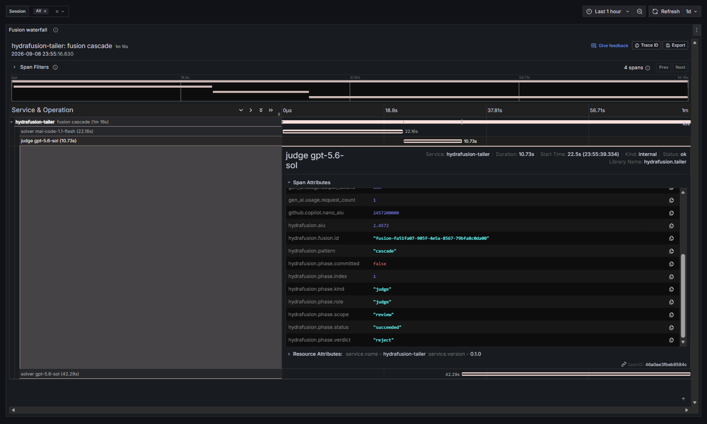
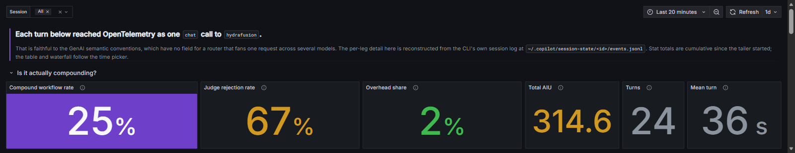
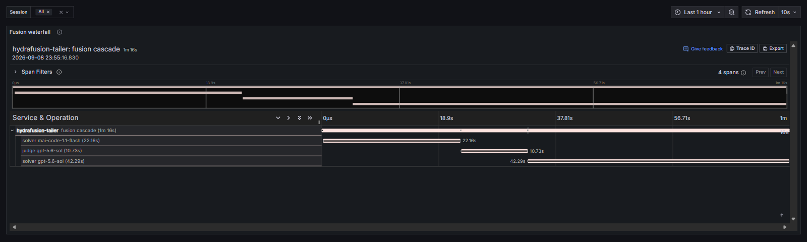
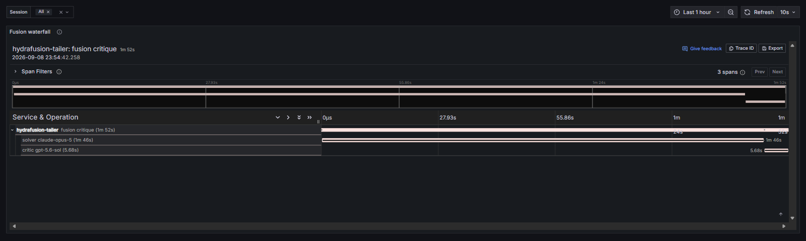
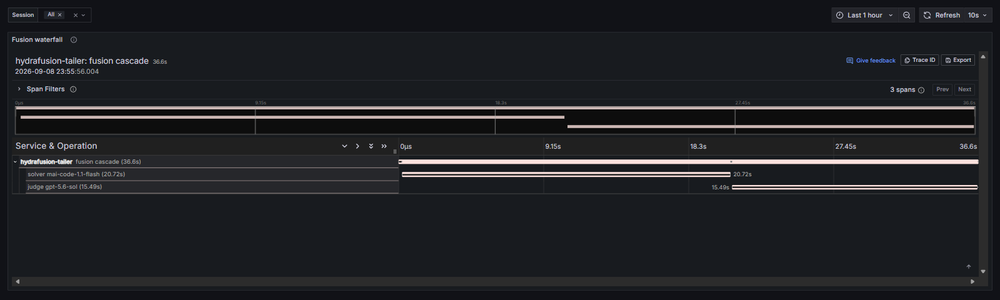
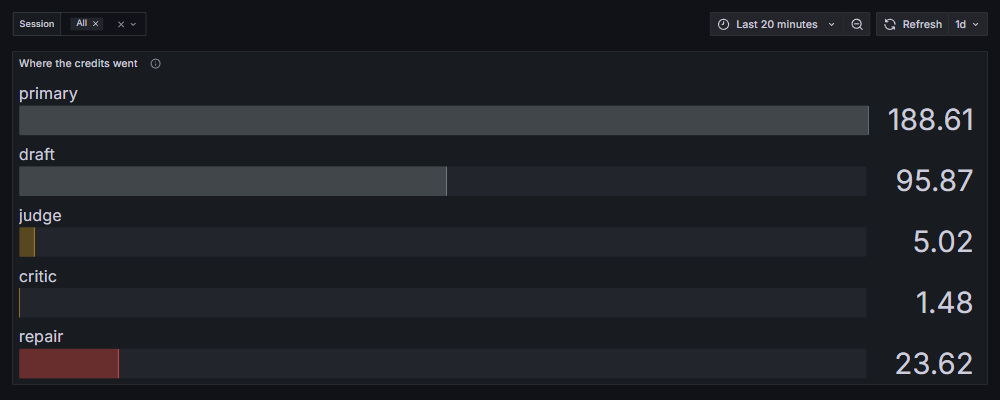

# Findings

Copilot CLI 1.0.84-2, Windows, 2026-09-09. **24 turns**, one machine, one small Python
project, one operator writing the prompts.

Read this as a field report, not an evaluation. Twenty-four turns is enough to describe
what the telemetry contains and to show the dashboard works. It is nowhere near enough to
judge a routing policy, and nothing here should be read as a statement about model
quality. HydraFusion is a research preview and is expected to change.

## What the CLI emits, and why

The CLI's OpenTelemetry output describes the **turn**. Each one appears as a `chat`
operation with `gen_ai.request.model=hydrafusion`, alongside `invoke_agent` and
`execute_tool` spans and a set of agent-level metrics.

That is a faithful reading of the
[GenAI semantic conventions](https://opentelemetry.io/docs/specs/semconv/gen-ai/).
`gen_ai.request.model` is defined as the model the client asked for, and the client did
ask for `hydrafusion`. The conventions currently have no concept of a routing layer that
expands one request into several model calls, so there is no `gen_ai.response.model` to
populate per leg and nowhere for per-leg cost to live. The CLI is not hiding anything; the
vocabulary does not exist yet.

Full measurements are in [SPIKE.md](SPIKE.md).

The detail is recorded locally all the same. `~/.copilot/session-state/<id>/events.jsonl`
carries the routing pattern, the phase plan, the per-phase model, reviewer verdicts,
per-phase tokens and credits, and the handoffs between phases. That file exists so the CLI
can resume and rewind a session; this project simply reads it for a second purpose.

Here is one leg of one turn as the tailer rebuilds it:

`gen_ai.request.model` is `hydrafusion`, per the conventions.
`gen_ai.response.model` is `gpt-5.6-sol`, from the session log. Both are true.

## Shape of the sample

| Pattern | Turns | Total AIU | Median AIU | Range | Mean wall |
|---|---|---|---|---|---|
| `single` | 18 | 187.03 | 7.97 | 2.25 – 36.24 | 27.7 s |
| `cascade` | 3 | 30.22 | 14.72 | 2.39 – 14.72 | 63.8 s |
| `critique` | 3 | 97.35 | 51.79 | 0.51 – 51.79 | 60.9 s |

**Do not read those columns as a cost comparison between patterns.** The router chooses
the pattern based on the request, so pattern and task difficulty are confounded. A
`critique` costing 51.79 AIU tells you the router sent a hard task to `critique`, not that
`critique` is expensive. Note also how wide the ranges are: `critique` spans two orders of
magnitude, from a 0.51 AIU three-item lookup to a 51.79 AIU refactor.

Compound workflow rate was 25%: six of twenty-four turns used more than one model.

## Five models across twenty-four turns

| Model | AIU | Share | Legs |
|---|---|---|---|
| `gpt-5.6-sol` | 180.73 | 57.4% | 24 |
| `claude-opus-5` | 131.78 | 41.9% | 3 |
| `gpt-5.6-luna` | 0.98 | 0.3% | 2 |
| `mai-code-1.1-flash` | 0.92 | 0.3% | 2 |
| `gpt-5.6-terra` | 0.19 | 0.1% | 1 |

Three of these are not in the CLI's public model list, which is unsurprising for a preview
that is explicitly about routing across a private pool. `claude-opus-5` appeared only for
the heaviest tasks in the set — multi-file refactors and a delete-and-verify pass — and
took 42% of total spend across three legs.

The interesting thing is not the leaderboard, which is meaningless at this sample size.
It is that the pool is heterogeneous across vendors and that the router reaches into it
per phase rather than per session.

## Two compound patterns with different shapes

`cascade` and `critique` are not variants of one mechanism.

**`cascade`** runs `primary` → `judge` → `repair`, and the judge emits a verdict:

`mai-code-1.1-flash` drafted for 22 s and 0.58 AIU. `gpt-5.6-sol` reviewed it, returned
`reject`, and produced the final answer itself in 42 s and 11.69 AIU.

**`critique`** runs `draft` → `critic`, carries no verdict field, and commits the draft:

`claude-opus-5` drafted for 1 m 46 s and 51.11 AIU; `gpt-5.6-sol` critiqued it for 5.7 s
and 0.69 AIU. Here the review is a cheap pass over expensive work. In a cascade the judge
is a gate that can add a second full attempt. Same idea, opposite cost profile.

Both compound patterns therefore need separate treatment in any cost model. Averaging them
into one "multi-model" bucket would hide the only difference that matters.

## The cascade gamble, both outcomes

An earlier draft of this document, written when the sample was four turns, claimed every
cascade ended in rejection. At twenty-four turns that is 2 of 3, and the third is the more
instructive one:

`mai-code-1.1-flash` answered an open-ended distributed-cache design question for 0.34
AIU. `gpt-5.6-sol` reviewed it and accepted. Total: **2.39 AIU**, against a median of
7.97 for `single` turns.

The internal split is worth noting: review cost 2.05 AIU, the answer cost 0.34. The check
cost six times the work it approved — and the turn was still roughly a fifth the median
cost of a comparable single-model turn. That is the mechanism working. A cheap answer plus
a cheap verification beat an expensive answer, and the verification is what makes the cheap
answer trustworthy enough to ship.

That single example does not establish that the gamble pays off on average. It does show
the payoff is real and that rejection is not the only outcome.

## Where the credits went

| Phase kind | AIU |
|---|---|
| `primary` | 188.61 |
| `draft` | 95.87 |
| `repair` | 23.62 |
| `judge` | 5.02 |
| `critic` | 1.48 |

One leg per turn supplies the answer you receive. Across all 24 turns, the legs that did
not amounted to **2.5% of spend** — 18 of 24 turns had no second leg at all.

Two caveats on calling that number "overhead":

- A superseded draft and its critique are in the repair leg's context. The final answer may
  be better for having them, so this is not equivalent to wasted spend. It is the portion
  of the bill that bought review rather than output.
- Judge rejection rate was 67% (2 of 3), on three data points. A rejection is the quality
  gate doing its job. A rate that stayed high across hundreds of turns would suggest the
  drafting model is mismatched to the work, which is a tuning signal rather than a fault.

## Token economics

Across 24 turns and 96 inference calls (4.0 per turn):

| | Tokens |
|---|---|
| Input | 1,524,207 |
| of which cached | 1,145,114 (75%) |
| Cache writes | 335,922 |
| Output | 25,713 |

Input outweighs output roughly 59:1, and three quarters of input was served from cache.
Any intuition that credits track visible output is wrong by two orders of magnitude — the
bill is dominated by context, and cache behaviour matters more than answer length.

This also explains an apparent oddity in the per-turn table: a short reply can cost more
than a long one, because a cold cache on a large context is the expensive part.

## Routing cost

Pattern selection took **172–371 ms** per turn (mean 229 ms) before any inference began.
`routeSource` was `capi_plan` and `policy` was `max` in all 24 turns, so the decision is
served remotely rather than computed locally. `contractVersion`, `planVersion`, and
`degradedReason` are all present in the event, which suggests the routing contract is
versioned and has a fallback path. `degradedReason` was null throughout; we never
triggered it.

A fifth of a second to pick a route, against turns averaging 28–64 seconds, is a small
price for the choice.

## Predicting the route from the prompt: mostly unsuccessful

| Prompt | Predicted | Actual |
|---|---|---|
| `Reply with exactly: SMOKE OK` | single | **single** |
| Off-by-one where the obvious fix is wrong | cascade | **single** |
| Retry policy for a non-idempotent payments API | critique | **cascade** |
| Mechanical rename across two files | single | **cascade** |
| "Name three stdlib modules for rate limiting" | single | **critique** |
| Multi-file refactor with a new abstraction | cascade | **critique** |

One hit in six, wrong in both directions and at both ends of the difficulty range.

The intuitive model — cheap draft for easy work, strong model for hard work, escalate when
the draft is weak — did not predict this sample. A three-item lookup routed to `critique`
across two models for 0.51 AIU. A subtle boundary bug with a failing test went straight to
`single` on the strongest model.

The honest conclusion is that our priors were poor and the sample is small, not that the
routing is arbitrary. `routeSource: capi_plan` means the policy is served and can be tuned
continuously, which is a sensible design for a preview and also means any rule inferred
from two dozen turns on one machine would be stale quickly. That is a good argument for
measuring it rather than reasoning about it, which is what this repo is for.

## Cross-checks

**Per-phase AIU sums to the turn total, exactly.** 0.575436 + 2.4572 + 11.68696 =
14.719596, matching the recorded turn total to the nanounit. No rounding drift, no double
counting.

**The dashboard agrees with the CLI's own credit counter, exactly**, on every turn
checked. A community thread reported the CLI counter disagreeing with a model's own
summary; we did not reproduce that, though we did not run sessions long enough to stress
it.

**One fusion per prompt, not per model call.** One turn resolved a single fusion that then
made 7 inference calls and 10 tool calls. `phaseCount` counts fusion legs; `requestCount`
counts inference calls. Conflating them would inflate the compound rate by roughly the
tool-use depth of the task.

## What the session log surfaces that the client does not

Not as a criticism of the CLI's UI, which deliberately keeps the turn simple — just as a
list of what becomes available once you read the log:

- The model that served each leg.
- Reviewer verdicts, the cost of each reviewed draft, and which leg produced the answer.
- Routing latency, and the fact that routing is remote and versioned.
- Per-leg token splits, including cache reads and writes.
- The existence of a degraded routing path.

## Worth measuring next

The obvious follow-ups, none of which two dozen turns can answer:

1. Judge rejection rate over hundreds of turns. This is the single number that determines
   whether cascade is a net saving.
2. Whether accepted cheap drafts hold up in review by a human, which telemetry cannot tell
   you.
3. Whether the overhead share stays near 3% as the compound rate rises.
4. Whether cache hit rate, rather than task difficulty, is what actually predicts turn cost.

## Where the plan changed

The original plan assumed fusion legs would appear as separate `chat` spans with distinct
`gen_ai.response.model` values, and built its metrics phase around Tempo's span-metrics
generator with that attribute as a dimension. Since the conventions have no such attribute
here, the generator is disabled; it would have produced one series labelled `hydrafusion`.

The `events.jsonl` reader, planned as optional polish conditional on the spike, turned out
to be the entire product.
